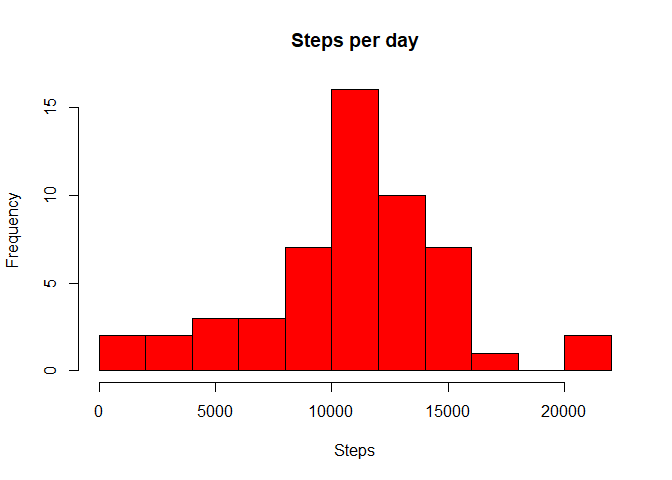
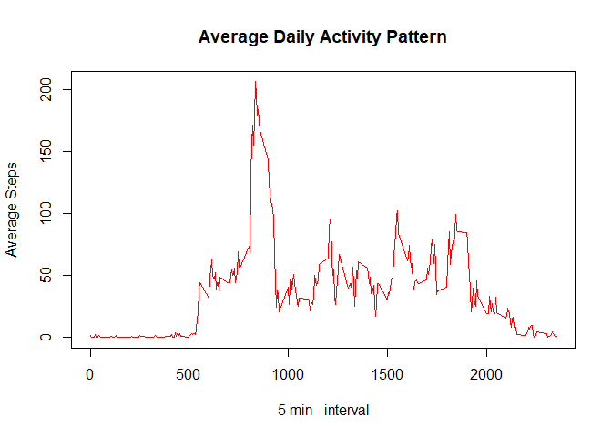
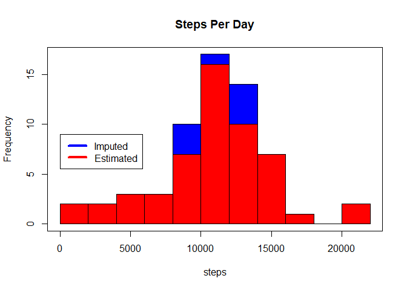
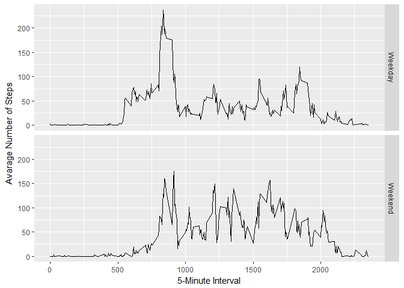

# Reproducible Research: Peer Assessment 1

# Required Packages
Package  | Description       
------------- | -------------
dplyr  | [dplyr package](https://cran.r-project.org/web/packages/dplyr/dplyr.pdf) 
pander  | [pander package](https://cran.r-project.org/web/packages/pander/pander.pdf) 
ggplot2 | [ggplot2](https://cran.r-project.org/web/packages/ggplot2/ggplot2.pdf) 


```r
## Load plyr package for manipulating data
library(dplyr)
library(pander)
library(ggplot2)

panderOptions("digits", 2)
```

#Introduction
This analysis makes use of data from a personal activity monitoring device.
This device collects data at 5 minute intervals through out the day. The data
consists of two months of data from an anonymous individual collected during
the months of October and November, 2012 and include the number of steps
taken in 5 minute intervals each day.

#Loading and preprocessing the data

**Getting the Data**
The data can be downloaded from the following location [Activity monitoring data](https://d396qusza40orc.cloudfront.net/repdata%2Fdata%2Factivity.zip)

The variables included in this dataset are:

* steps: Number of steps taking in a 5-minute interval (missing values are
coded as NA)
* date: The date on which the measurement was taken in YYYY-MM-DD
format
* interval: Identifier for the 5-minute interval in which measurement was
taken

The dataset is stored in a comma-separated-value (CSV) file and there are a
total of 17,568 observations in this dataset.


```r
# Uncompress and load the data
# Variable activity_data (Activity Monitoring Data)
activity_data <- read.csv(unzip("activity.zip", "activity.csv"))

# Convert date
activity_data$date <-
  as.POSIXct(strptime(activity_data$date, "%Y-%m-%d"))
```


# What is mean total number of steps taken per day?


```r
sum_spd <- activity_data[complete.cases(activity_data),] %>%
  group_by(date) %>%
  summarise(steps = sum(steps))

## Plot sum of steps per day
hist(
  sum_spd$steps,
  main = "Steps per day",
  xlab = "Steps",
  col = "red",
  breaks = 8
)
```

<!-- -->

**Report of mean and median of the total number of steps taken per day**


```r
## Display the data 
rep_temp <- cbind(mean(sum_spd$steps), median(sum_spd$steps))
colnames(rep_temp) <- c("Mean", "Median")
pander(rep_temp)
```


----------------
 Mean    Median 
------- --------
 10766   10765  
----------------

# What is the average daily activity pattern?


```r
mean_spi <- activity_data[complete.cases(activity_data),] %>%
  group_by(interval) %>%
  summarise(steps = mean(steps))

plot(
  mean_spi$interval,
  mean_spi$steps,
  type = "l",
  xlab = "5 min - interval",
  ylab = "Average Steps",
  main = "Average Daily Activity Pattern",
  col = "red"
)
```

<!-- -->

**What interval has the biggest numbers of steps?**


```r
  pander(mean_spi$interval[which.max(mean_spi$steps)])
```

_835_

# Imputing missing values

**Count the number of missing values?**


```r
  pander(nrow(activity_data[is.na(activity_data$steps),]))
```

_2304_

**Imputed data strategy**

Imputing stratagy is to replace NA with mean of that interval for a given day.

**Imputed Dataset**


```r
# Calculate the mean steps per interval per day of the week
mean_interval_days <-
  activity_data[complete.cases(activity_data),] %>%
  group_by(interval, weekdays(date)) %>%
  summarise(steps = mean(steps))

colnames(mean_interval_days) <- c("interval", "days", "steps")

## Create complete and incomplete datasets
activity_data_complete <-
  activity_data[complete.cases(activity_data),]
activity_data_nas <-
  activity_data[!complete.cases(activity_data),]

## Create a new column for the day of the week for the dataset
activity_data_nas$days <- weekdays(activity_data_nas$date)

## Merge the datasets
nas_imputed <-
  activity_data_nas %>% inner_join(mean_interval_days, by = c("interval", "days"))
## Keep only the required columns and drop the NA steps.x column
nas_imputed <- nas_imputed[c("steps.y", "date", "interval")]
## Rename columns
colnames(nas_imputed) <- c("steps", "date", "interval")

## rbind datasets
activity_data_imputed <-
  rbind(activity_data_complete, nas_imputed)

## Create new aggregate datasets
sum_imputed <- activity_data_imputed %>%
  group_by(date) %>%
  summarise(steps = sum(steps))

hist(
  sum_imputed$steps,
  col = "Blue",
  main = "Steps Per Day",
  xlab = "steps",
  breaks = 8
)
hist(sum_spd$steps,
     col = "Red",
     add = T,
     breaks = 8)
legend(4,
       9,
       c("Imputed", "Estimated"),
       lwd = 4,
       col = c("blue", "red"))
box()
```

<!-- -->

```r
rep_temp <-
  cbind(
    mean(sum_spd$steps),
    median(sum_spd$steps),
    mean(sum_imputed$steps),
    median(sum_imputed$steps)
  )
colnames(rep_temp) <-
  c("Est Mean", "Est Median", "Mean Imputed", "Median Imputed")
pander(rep_temp)
```


-------------------------------------------------------
 Est Mean   Est Median   Mean Imputed   Median Imputed 
---------- ------------ -------------- ----------------
  10766       10765         10821           11015      
-------------------------------------------------------

The missing values reduce the overall frequency of the number of steps in the mid ranges of the histogram, although the averages are only marginally adjusted upwards.


#Are there differences in activity patterns between weekdays and weekends?


```r
# Add the dotw (Day of the Week) column to show if the data is a weekday or weekend

activity_data_imputed$dotw <-
  as.factor(ifelse(
    weekdays(activity_data_imputed$date)
    %in% c("Sunday", "Saturday"),
    'Weekend',
    'Weekday'
  ))

# Impute steps per interval, group by interval and dotw
imputed_spi <- activity_data_imputed %>%
  group_by(interval, dotw) %>%
  summarise(steps = mean(steps))

# Create facet based plot for ggplot
ggplot(imputed_spi, aes(interval, steps)) +
  geom_line() +
  facet_grid(dotw ~ .) +
  xlab("5-Minute Interval") +
  ylab("Avarage Number of Steps")
```

<!-- -->

The datasets show that the activity starts later at a weekend and there is a more even distribution in the middle intervals.

# Appendix - Session Info Package Versions

```r
sessionInfo()
```

```
## R version 3.4.2 (2017-09-28)
## Platform: x86_64-w64-mingw32/x64 (64-bit)
## Running under: Windows 10 x64 (build 16299)
## 
## Matrix products: default
## 
## locale:
## [1] LC_COLLATE=English_United Kingdom.1252 
## [2] LC_CTYPE=English_United Kingdom.1252   
## [3] LC_MONETARY=English_United Kingdom.1252
## [4] LC_NUMERIC=C                           
## [5] LC_TIME=English_United Kingdom.1252    
## 
## attached base packages:
## [1] stats     graphics  grDevices utils     datasets  methods   base     
## 
## other attached packages:
## [1] bindrcpp_0.2  ggplot2_2.2.1 pander_0.6.1  dplyr_0.7.4  
## 
## loaded via a namespace (and not attached):
##  [1] Rcpp_0.12.13     knitr_1.17       bindr_0.1        magrittr_1.5    
##  [5] munsell_0.4.3    colorspace_1.3-2 R6_2.2.2         rlang_0.1.2     
##  [9] plyr_1.8.4       stringr_1.2.0    tools_3.4.2      grid_3.4.2      
## [13] gtable_0.2.0     htmltools_0.3.6  lazyeval_0.2.1   yaml_2.1.14     
## [17] assertthat_0.2.0 rprojroot_1.2    digest_0.6.12    tibble_1.3.4    
## [21] reshape2_1.4.2   glue_1.2.0       evaluate_0.10.1  rmarkdown_1.6   
## [25] labeling_0.3     stringi_1.1.5    compiler_3.4.2   scales_0.5.0    
## [29] backports_1.1.1  pkgconfig_2.0.1
```
